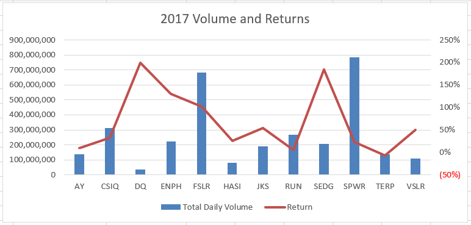
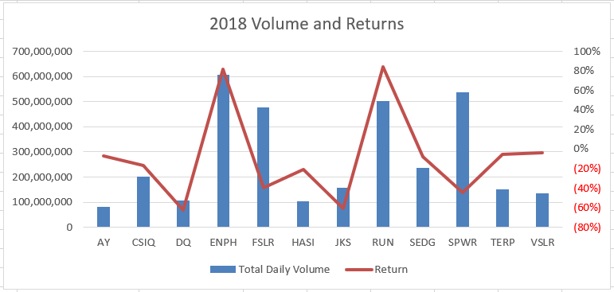
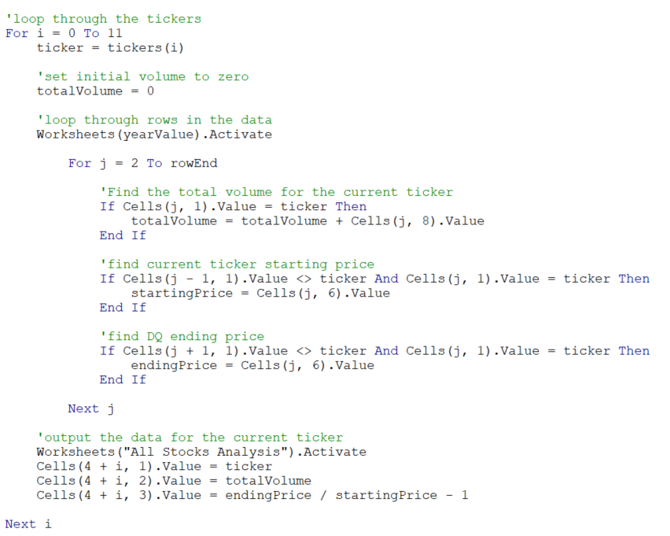
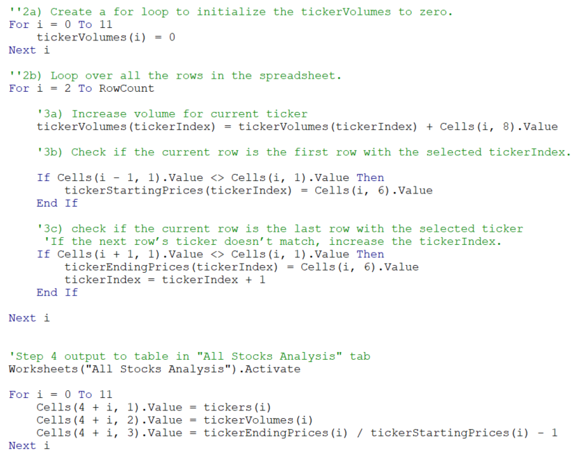
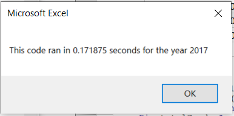
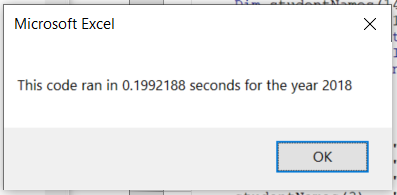

# Stock Analysis Project

## Project Overview
The goals of this project are: 
1. Analyze if there is a relationship between daily trading volume and returns in stocks
1. Refactor code to improve performance of VBA subroutines 

## Results
### 1. Daily Trading Volume and Returns of stocks
After analyzing the daily trading volume and the annual returns of 2017 and 2018 for the given list of stocks, I believe there is no relationship between a stock's daily trading volume and its annual returns. Below we can see that our list of stocks, in general, delivered higher returns during 2017 compared to 2018. However, stock performance does not seem to correlate to performance for either year.

**2017 Stock Annual Returns vs. Total Daily Trading Volume** 

**2018 Stock Annual Returns vs. Total Daily Trading Volume** 

 

### 2. Refactoring VBA Subroutines
Using the indexed variable framework, I was able to break down a nested loop into three simple loops. This improved the run time of the overall tasks by over 5 folds from over 1 second to roughly 200 milliseconds.

 

*Below is the nested loop I started with where the "j" loop (3000+ rows) was executed 12 times by the "i" loop.*  
*(see the AllStocksAnalysis subroutine in the VBA_Challenge excel file for the complete subroutine)*  
[VBA_Challenge_Excel_File](VBA_Challenge.xlsm)

 

*For the refactoring exercise, I broke down the nested loop by indexing my variable.  I wrote 3 simple loops to accomplish the same tasks as the nested loop above and only run through the 3,000+ rows once.* 
*(see the AllStocksAnalysisRefactored subroutine in the VBA_Challenge excel file for the complete subroutine)*  
[VBA_Challenge_Excel_File](VBA_Challenge.xlsm)

 

*The run time of the refactored subroutine improved significantly.  For the 2017 and 2018 data sets, the run time decreased from over 1 second to roughly 200 milliseconds.*

  

## Summary
In situations with a large set of data with repetitive patterns, refactoring can potentially improve performance significantly. However, refactoring will take programming time, and in cases of small datasets, it may not generate meaningful performance improvements. For our dataset, refactoring gave us significant performance improvements since the dataset is quite large with over 3,000 rows, and it has a repeating pattern.
